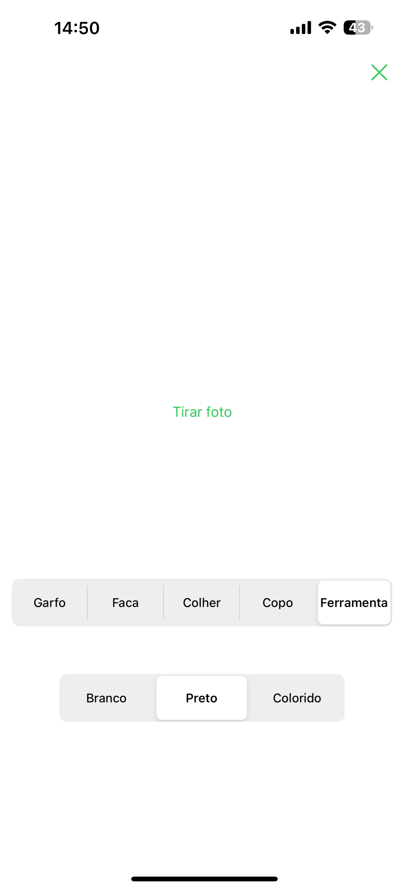
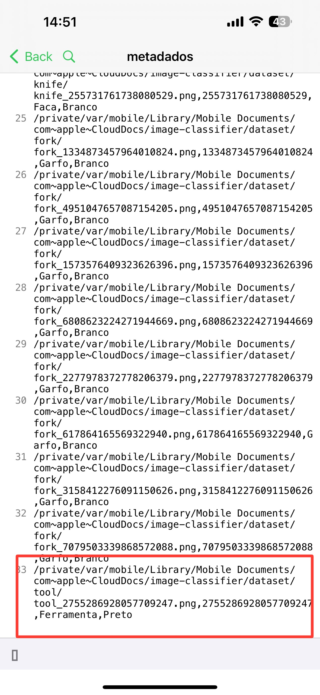
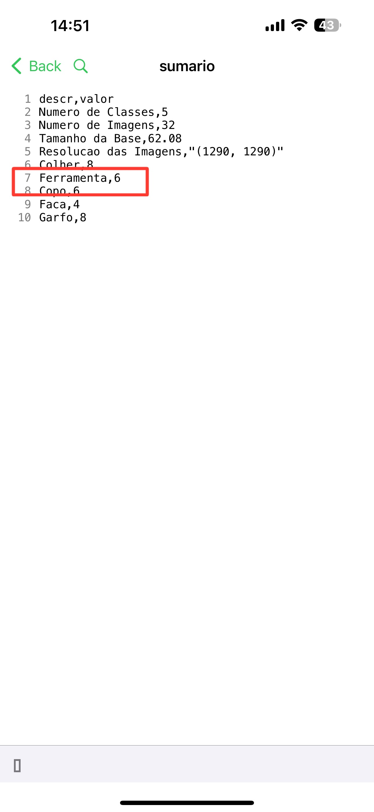

# Módulo de Captura e Gerenciamento de Imagens

Este módulo é utilizado para capturar e gerenciar imagens, armazenando metadados e resumos do dataset coletado.
O módulo funciona em dispositivo iOS, utilizando o interpretador do [Pyto](https://pyto.app/).

## Utilização e Funcionamento

Após a instalação do Pyto, o projeto deve ser carregado no app e ser executado através do script do `main.py`.
A interface de usuário é exibida em modo tela cheia, com um botão para captura de fotos e controles segmentados para seleção de classe e cor de fundo,
conforme figura a seguir:



Ao capturar uma foto, a imagem é salva no diretório correspondente e os metadados e sumário são atualizados, 
conforme demonstrado pelo exemplo a seguir:





### Metadados

O arquivo de metadados é armazenado em arquivo `metadados.csv` e tem os seguintes dados:
nome do arquivo, ID do objeto, nome da classe e cor de fundo.

### Sumário

O arquivo de sumário é armazenado em arquivo `sumario.csv` e tem os seguintes dados:
número de classes, número de imagens, tamanho do dataset em MB, largura e altura das imagens, número de imagens para cada
uma das classes.

### Estrutura de Diretórios

O módulo não é capaz de criar diretórios, por conta de uma questão de permissões do iOS. Portanto, é necessário criar
os diretórios manualmente, conforme a estrutura a seguir:

```
├── dataset
│   ├── cup
│   ├── fork
│   ├── knife
│   ├── metadados.csv
│   ├── spoon
│   ├── sumario.csv
│   └── tool
└── src
    └── main.py
```

### Configurações

A implementação das classes é feita no arquivo `src/main.py`, onde é possível alterar o nome das classes e as cores de fundo.

```python
CLASSES = {
    "fork": Item("fork", "Garfo", 1),
    "knife": Item("knife", "Faca", 2),
    "spoon": Item("spoon", "Colher", 3),
    "cup": Item("cup", "Copo", 4),
    "tool": Item("tool", "Ferramenta", 5),
}

BACKGROUNDS = ["Branco", "Preto", "Colorido"]

```